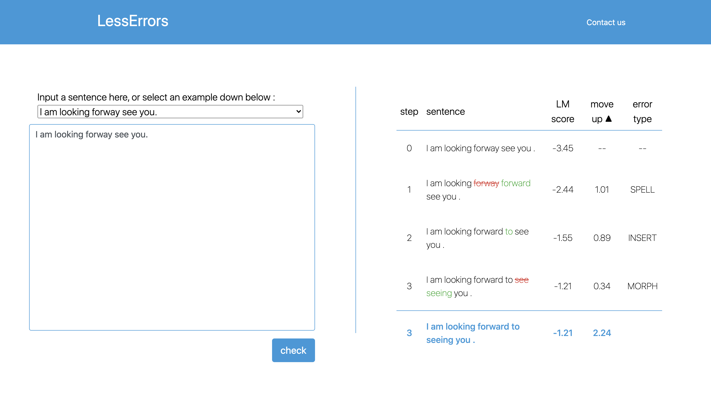

# lesserrors-frontend
This repo is for the frontend of [LessErrors](https://github.com/as10896/LessErrors)

http://lesserrors.linggle.com/

# Preview



# Run Server

Please set up your API endpoint [here](https://github.com/NTHU-NLPLAB/lesserrors-frontend/blob/master/static/js/main.js#L51) before starting the frontend server

```
python -m http.server <PORT_NUMBER> 
```
